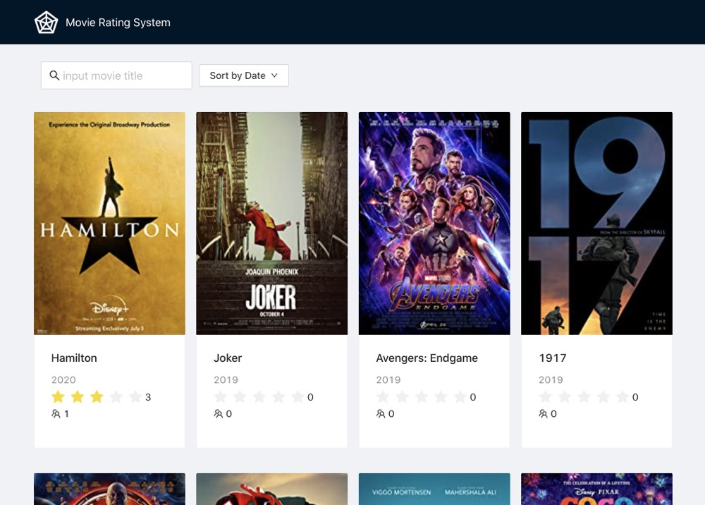
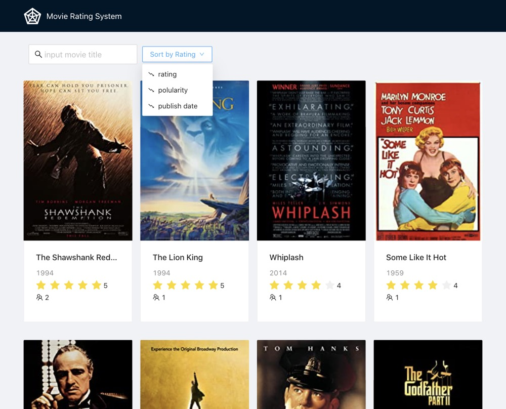
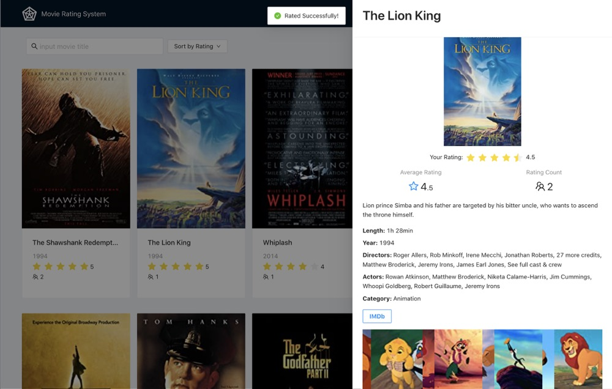
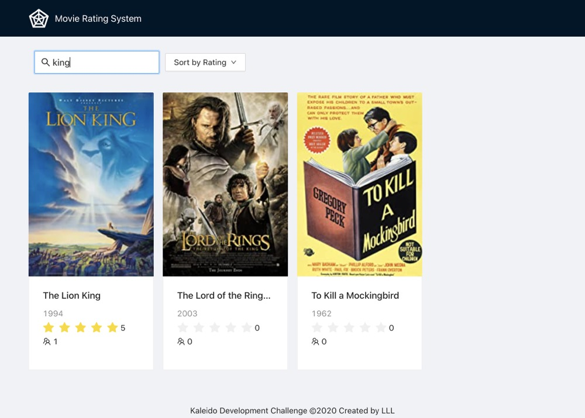
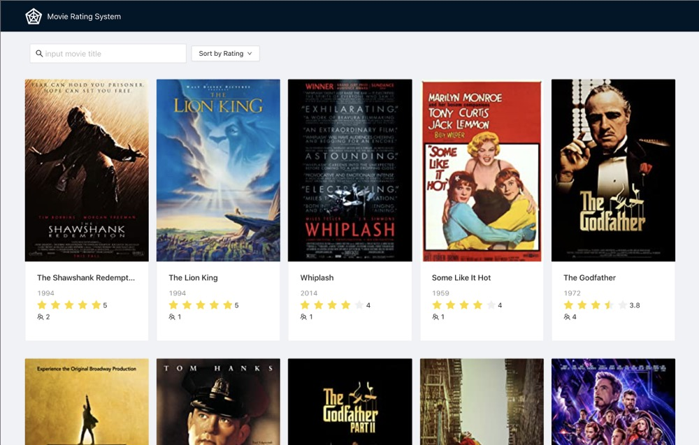
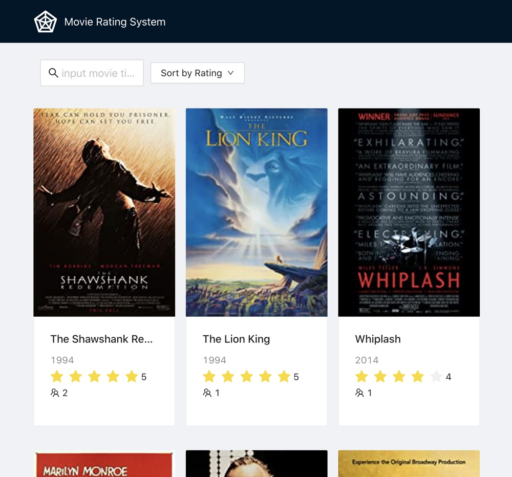
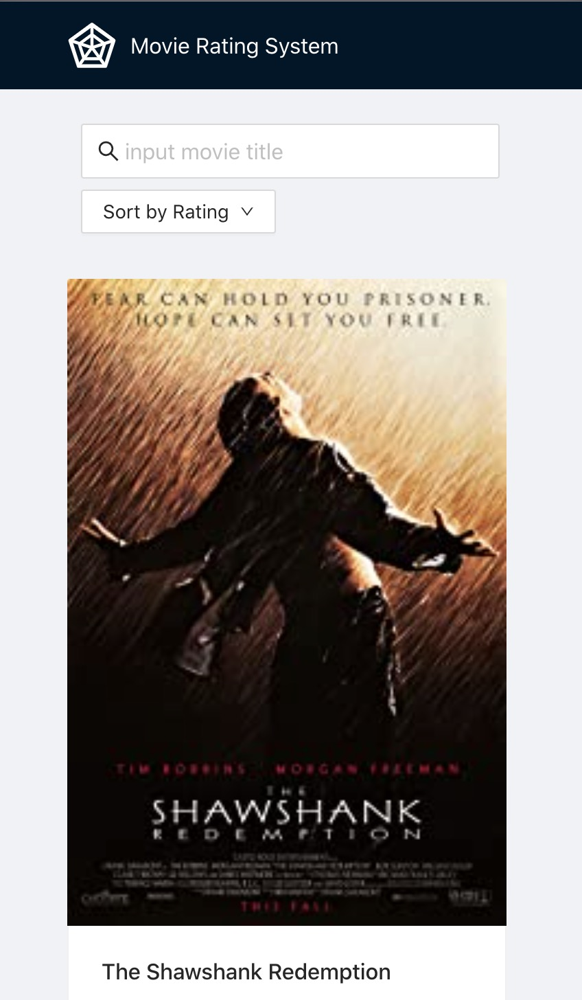

# Developer Challenge - Movie Rating System

## Introduction

This is a blockchain backed rating system for movies
It allows user to browser and rate movies.

## Start it up
### Before start
#### 1. dependency
Install all the dependecy at both frontend & backend with `npm install`
#### 2. deploy contract
Rating data is saved in Kaleido. Use the following commands to deploy a contract:
  ```
  cd backend/scripts/
  node bootstrap.js
  ```
  `Deployed instance` and `openapi` will be printed out in terminal. Copy `backend/config.example.js` to `backend/config.js` and replace the value of `CONTRACT_INSTANCE` and `OPENAPI` with the printed values.

#### 3. crawl data
The repo has already included pre-crawled data of 250 movies from IMDb, saved in `backend/data.json`. Use the following steps to re-crawl:
```
cd backend/scripts
node crawler.js
```

### Run for production
Build the client with the following command
```
cd frontend
npm run-script build
```
Start the server:
```
cd backend
NODE_ENV=production npm start
```
Type `http://localhost:4000/` in browser to start using the system.

### Run for development
Start the backend in one terminal:
```
cd backend
npm start
```
Start the frontend development server in another terminal:
```
cd frontend
npm start
```
## Features
### List movies
List movies with posters, titles, average ratings, etc.
Movies can be sorted by rating, publish time or popularity.



### Rate movie
Click the movie card will open a drawer showing the detailed movie information and allow user to rate the movie.


### Search movie
Typing title keywords will instantly get the related movies.


### Responsive
Responsive to different viewsize.



